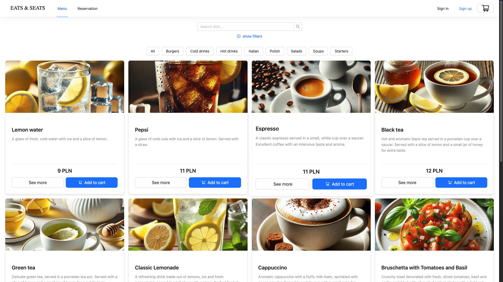
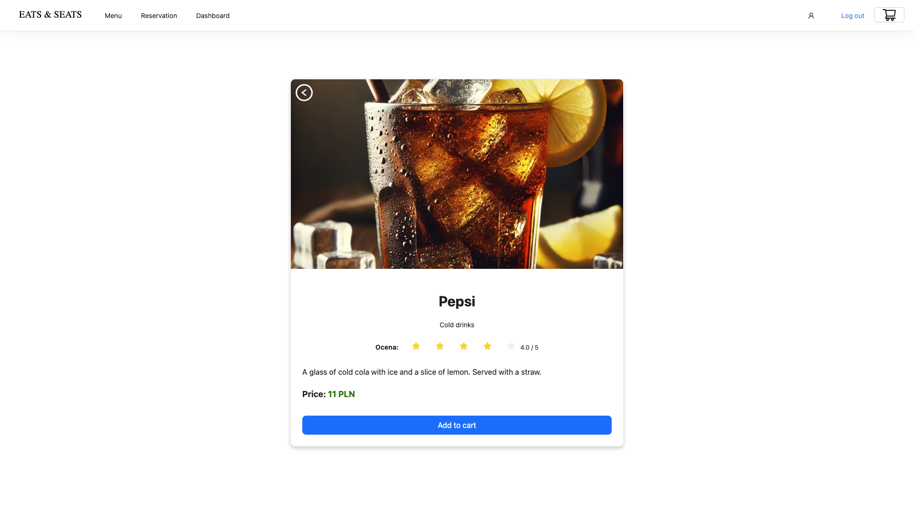
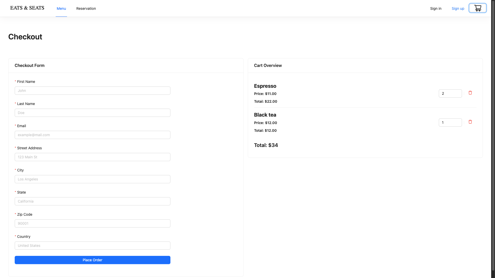
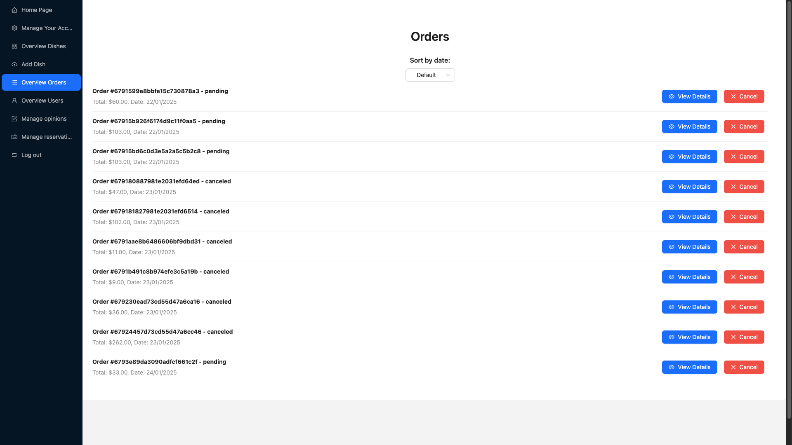
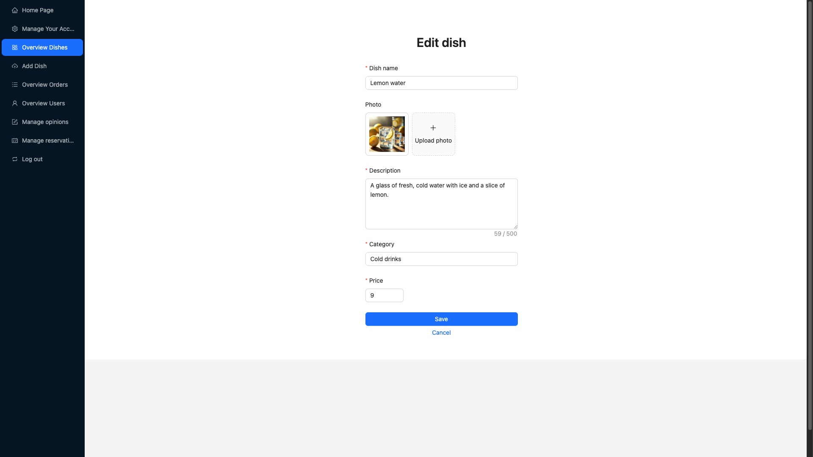

# Eats and Seats

**Eats and Seats** is a full-stack web application designed for food enthusiasts to browse delicious dishes and read reviews. Users can filter dishes based on category, price, and other metrics. Additionally, our platform offers a reservation form for booking a table and an order dishes functionality for ordering your favorite meals. An admin dashboard is available to manage reservations, orders, and user accounts with ease.

## Table of Contents

- [Features](#features)
- [Architecture](#architecture)
- [Backend](#backend)
- [Frontend](#frontend)
- [Built By](#built-by)
- [Live Version](#live-version)
- [Screenshots](#screenshots)
- [Installation](#installation)
- [Environment Setup](#environment-setup)
- [Usage](#usage)

## Features

- **Browse Dishes & Reviews:**  
  Explore a variety of dishes along with detailed reviews provided by other users.

- **Advanced Filtering:**  
  Filter dishes based on categories, price ranges, and other criteria to find exactly what you're looking for.

- **Reservation Form:**  
  Fill in a reservation form to book a table at your restaurant of choice.

- **Order Dishes:**  
  Seamlessly order dishes directly from the app for your next meal.

- **User Authentication & Security:**  
  Secure authentication using JSON Web Tokens (JWT) and password encryption.

- **Responsive, Modern UI:**  
  A sleek and intuitive interface built with React, Ant Design, and Vite that works seamlessly on both desktop and mobile devices.

- **Robust Backend Services:**  
  A backend powered by Express, MongoDB, and Mongoose, with additional support for file storage via GridFS and efficient data validation using Joi.

## Architecture

The project is organized into two main parts:

- **Backend**:  
  Located in the `backend/` folder, the backend is built with TypeScript and Express. It provides RESTful APIs for handling restaurant data, user authentication, reservations, and file uploads.

- **Frontend**:  
  Located in the `frontend/` folder, the frontend is a React application developed with Vite. It offers a responsive and interactive interface that integrates with the backend via API calls.

## Backend

The backend service is built using modern technologies and packages:
- **Express**: For creating robust REST APIs.
- **Mongoose & MongoDB**: To manage and interact with the database.
- **GridFS & multer-gridfs-storage**: For handling file uploads and storage.
- **JWT & bcrypt**: For secure user authentication and password management.
- **Joi**: For validating incoming data.

## Frontend

The frontend is a modern React application that leverages Vite for fast development and build times. Key technologies include:
- **React & React-DOM**: For building the user interface.
- **Ant Design**: For predefined UI components and rapid UI development.
- **React Query**: For efficient data fetching and state management.
- **React Router DOM**: For routing and navigation.
- **Vite**: As the frontend build tool offering an optimized development experience.

## Built By

This project was developed as part of a course assignment and represents the collaborative efforts of the following contributors:

- [Katarzyna Bęben](https://github.com/kasiabeben10)
- [Jakub Więcek](https://github.com/magmei)
- [Marceli Mietła](https://github.com/Carexo)

## Live Version

Experience the live version of Eats and Seats! Visit our live demo site to explore all the features and functionalities in real-time:

[Live Demo](https://eats-and-seats-client-86926715b813.herokuapp.com/)

## Installation

### Prerequisites

Ensure that you have Node.js and a package manager (npm) installed on your system.

## Screenshots

### Main Application

*The main interface where users can browse dishes and read reviews.*

### Dish Details

*Detailed information about a dish, including reviews and ratings.*

### Checkout

*Users can order dishes through this form.*

### Admin Dashboard - orders

*Admins can manage orders and reservations through the dashboard.*

### Admin Dashboard - edit dish

*Admins can edit dish details and upload images.*


### Clone the Repository

```bash
git clone https://github.com/Carexo/eats-and-seats.git
cd eats-and-seats
```

### Install Dependencies

#### For the Backend

```bash
cd backend
npm install
```

#### For the Frontend

```bash
cd ../frontend
npm install
```
## Environment Setup

### Backend

Create a `.env` file in the `backend/` folder with the following variables:

```env
MONGO_URI=your_mongo_connection_string
JWT_SECRET=your_jwt_secret_key
```

### Frontend

Create a `.env` file in the `frontend/` folder with the following variable:

```env
VITE_API_BASE_URL=your_api_base_url
```

## Usage

### Running the Backend

```bash
cd backend
npm run dev
```
The backend server will start on the port specified in your environment configuration.

### Running the Frontend

```bash
cd frontend
npm run dev
```
The frontend application will run on `http://localhost:3000` (or the port specified by Vite).
